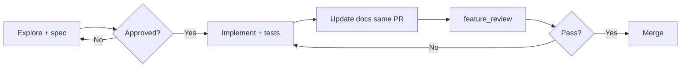

# New project playbook

Human guide for starting a Laravel + Nuxt (+ optional Flutter) project from [Agents Starter Kit](https://github.com/elbakkali/agents-starter-kit). For agent instructions, see root [`AGENTS.md`](../AGENTS.md).

---

## Phase 0 — Template → your repo

1. **Clone the kit**

   ```bash
   git clone https://github.com/elbakkali/agents-starter-kit.git my-app
   cd my-app
   ```

2. **Point origin at your new GitHub repo**

   ```bash
   git remote remove origin
   git remote add origin git@github.com:YOUR_ORG/my-app.git
   git push -u origin main
   ```

3. **Rename local folder** (optional)

   ```bash
   cd ..
   mv agents-starter-kit my-app
   cd my-app
   ```

4. **GitHub repo About & topics** — paste from [`.github/REPOSITORY.md`](../.github/REPOSITORY.md) into **Settings → General → About**. Customize description for your product; keep or trim topics as needed.

---

## Phase 1 — Bootstrap (day 0)

1. **Root env**

   ```bash
   cp .env.docker.example .env
   ```

2. **Automated bootstrap** (recommended)

   ```bash
   python3 -m scripts.tasks.bootstrap_project
   # Non-interactive: --yes
   # Skip scaffold if apps exist: --skip-scaffold
   # Include Flutter: --flutter
   ```

   Manual steps: [bootstrap.md](technical/bootstrap.md).

3. **What bootstrap does** — Scaffolds Laravel (`api/`), Nuxt (`web/`), optional Flutter (`app/`); copies env templates; aligns DB/Redis/Mail with Docker service names (`postgres`, `redis`, `mailpit`).

4. **Start stack**

   ```bash
   docker compose up -d --build
   docker compose exec api composer install
   docker compose exec api php artisan key:generate
   docker compose exec api php artisan migrate
   docker compose exec web npm install
   ```

5. **Verify URLs**

   | Service | Default URL |
   |---------|-------------|
   | Web (nginx) | http://localhost:8080 |
   | API | http://localhost:8080/api |
   | Mailpit | http://localhost:8025 |
   | OpenAPI (after Scramble) | http://localhost:8080/docs/api |

6. **Green gate**

   ```bash
   python3 -m scripts.tasks.feature_review
   ```

   Template mode: kit checks pass; app lint/test skip until real scaffolds exist.

---

## Phase 2 — Project identity

Fill stubs before feature work so agents and humans share context.

| File | Purpose |
|------|---------|
| [`docs/product/overview.md`](product/overview.md) | Vision, users, value prop |
| [`docs/product/features.md`](product/features.md) | Feature list and status |
| [`docs/product/user-flows.md`](product/user-flows.md) | Key user journeys |
| [`docs/technical/architecture.md`](technical/architecture.md) | System design — copy from [`architecture.example.md`](technical/architecture.example.md) as a starting point |

**README:** Replace kit marketing copy with your product name and links. Optionally add `PROJECT.md` for product-specific onboarding.

**Session handoff:** Copy [`HANDOFF.md.template`](technical/HANDOFF.md.template) → `docs/technical/HANDOFF.md` (gitignored) for multi-session AI work.

---

## Phase 3 — Agent workflow

### Read first

- Root [`AGENTS.md`](../AGENTS.md) — repo map, Docker commands, boundaries
- Nearest package `AGENTS.md` (`api/`, `web/`, `app/`)
- Relevant [`.cursor/rules/`](../.cursor/rules/) (load on demand by path)

**Tool choice:** Cursor (rules + skills), Claude Code (`.claude/rules/`), Copilot (`.github/instructions/`). Edit `.cursor/rules/*.mdc` only; run `python3 -m scripts.tasks.sync_adapters` to propagate.

### Spec → implement → review



1. **Start feature** — [`.cursor/skills/start-feature/SKILL.md`](../.cursor/skills/start-feature/SKILL.md)

   ```bash
   python3 -m scripts.tasks.scaffold_feature "Feature name"
   ```

   Get explicit approval before coding.

2. **When to use other skills**

   | Skill | Use when |
   |-------|----------|
   | `planner` | Large/ambiguous feature — spec only, no code |
   | `implementer` | Approved spec ready to build |
   | `reviewer` | Pre-merge self-review, security + feature_review |

3. **Always**

   - Same-PR docs (`docs/technical/` and/or `docs/product/`)
   - `python3 -m scripts.tasks.feature_review` before marking done
   - `sync_adapters` after editing `.cursor/rules/*.mdc`

---

## Phase 4 — Daily commands

**Devkit menu** (primary UI):

```bash
python3 scripts/devkit.py
```

Categories: Docker, Development, Documentation, Quality.

**just shortcuts** ([`justfile`](../justfile)):

| Command | Action |
|---------|--------|
| `just up` | `docker compose up -d --build` |
| `just down` | Stop stack |
| `just review` | `feature_review` |
| `just docs` | `docs_check` |
| `just sync` | `sync_adapters` |
| `just test` / `just lint` | All packages (native) |

**Per package (Docker)**

```bash
docker compose exec api php artisan test
docker compose exec api ./vendor/bin/pint
docker compose exec web npm run test
docker compose exec web npm run lint
```

**Pre-commit** (optional, local):

```bash
pip install pre-commit && pre-commit install
```

Daily workflow: [setup-local.md](technical/setup-local.md).

---

## Phase 5 — CI & quality gates

**CI** ([`ci.yml`](../.github/workflows/ci.yml)): kit (`docs_check`, `check_doc_updates`, orphans, adapters, AGENTS) → security → lint/test/static analysis → Docker build when manifests exist.

**Doc updates rule:** Code changes in `api/`, `web/`, or `app/` require a matching doc change under `docs/technical/` or `docs/product/`.

**Security** ([`security.yml`](../.github/workflows/security.yml)): Gitleaks, TruffleHog, dependency review (PRs), CodeQL, weekly schedule.

**Dependabot** ([`dependabot.yml`](../.github/dependabot.yml)): weekly Composer, npm, Actions, pub (when `app/pubspec.yaml` exists).

---

## Phase 6 — Shipping

1. **Production checklist** — [setup-production.md](technical/setup-production.md): TLS, secrets, migrate, health checks.
2. **Before merge**
   - `python3 -m scripts.tasks.feature_review`
   - `python3 -m scripts.tasks.security_check`
   - PR template checklist ([`.github/pull_request_template.md`](../.github/pull_request_template.md)): spec link, tests, docs, security items.
3. **Deploy** using your host/orchestrator; never commit production `.env`.

Security detail: [security.md](technical/security.md).

---

## Troubleshooting

| Issue | Fix |
|-------|-----|
| Empty `api/` after clone | Run `bootstrap_project` or `composer create-project laravel/laravel api` |
| DB connection refused | `DB_HOST=postgres` in `api/.env`; stack running |
| Web cannot reach API | Match `NUXT_PUBLIC_API_BASE` to root `.env` `HTTP_PORT` (default 8080) |
| Port 8080 in use | Change `HTTP_PORT` in root `.env`; update `NUXT_PUBLIC_API_BASE` |
| Kit stub vs real app | Kit ships placeholders until bootstrap; `feature_review` skips app jobs until `composer.json` / real Nuxt exist |
| `feature_review` docs fail | Update `docs/technical/` or `docs/product/` in same PR as code |
| Adapter drift | `python3 -m scripts.tasks.sync_adapters` after editing `.mdc` rules |
| PHPStan / typecheck missing | Install per [bootstrap.md](technical/bootstrap.md) static analysis section |

---

## Quick reference

| Phase | Doc |
|-------|-----|
| Bootstrap detail | [bootstrap.md](technical/bootstrap.md) |
| Local dev | [setup-local.md](technical/setup-local.md) |
| Production | [setup-production.md](technical/setup-production.md) |
| Agent rules | [AGENTS.md](../AGENTS.md) |
| Multi-editor sync | [agent-adapters.md](technical/agent-adapters.md) |
